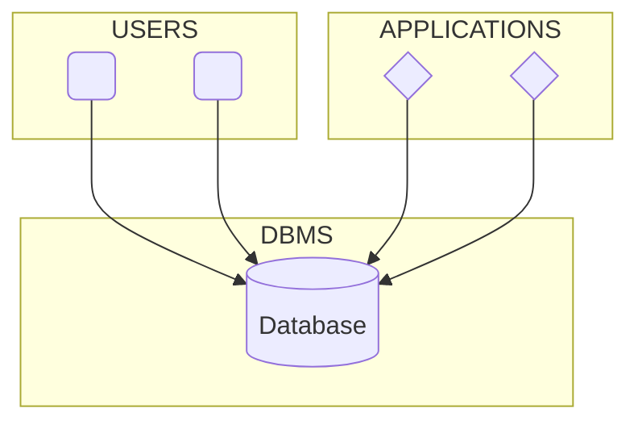
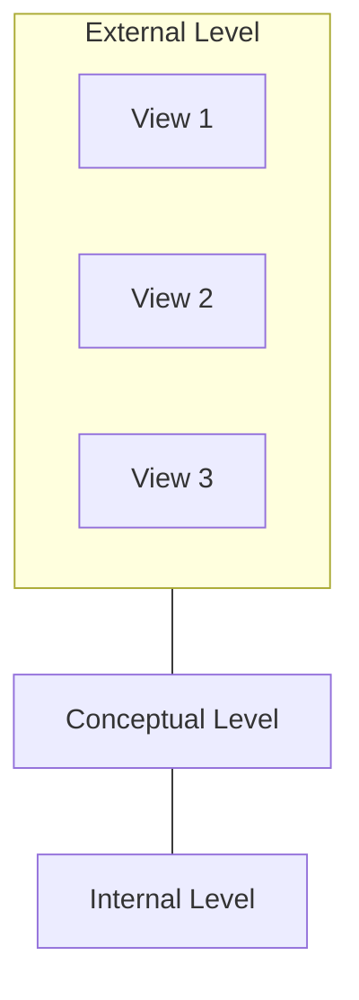
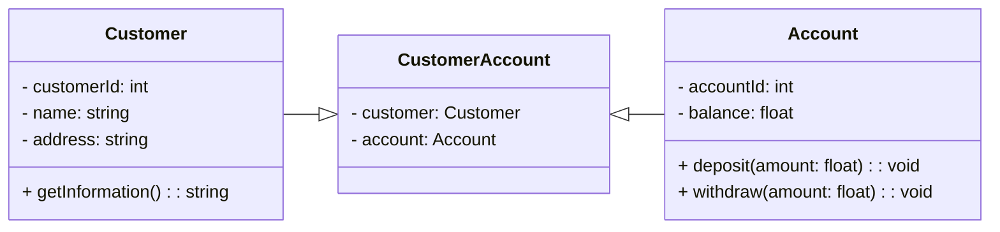
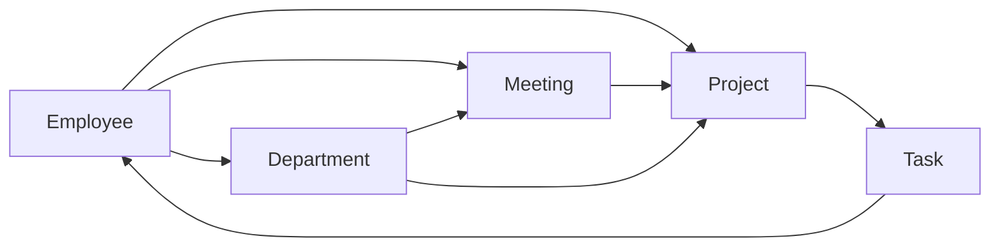
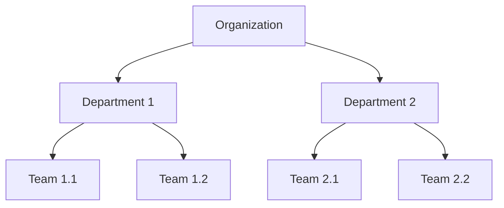

## Introduction

The aim of this guide is to acquaint any enthusiast and passionate individual with the captivating universe of databases within the realm of data analysis. Throughout this journey, we will delve into the fundamentals of the database concept and its extensive applicability in projects worldwide. Additionally, we will take a foray into introducing the model, offering a comprehensive insight into the essential tools and techniques required to manipulate and extract valuable information from datasets.

I invite and offer this guide to anyone who shares my passion for the programming universe. Whether you are a new student eager to embark on your journey or someone with extensive experience in the field looking to expand your knowledge, this guide has been crafted with the aim of providing an enriching experience.

## What is a Database?

A database is an organized collection of structured information, or data, stored either in a manual system or electronically in a computer system. In a manual system, information is stored in files within drawers, making the retrieval and querying of this information quite laborious as it requires manual searching. In a computerized system, information is stored on magnetic media, and the retrieval of information is carried out through specific software.

With the switch to electronic storage, several advantages have emerged. This shift to digital storage has brought:

- **Streamlined and Efficient Retrieval Processes**
- **Space Optimization** 
- **Collaborative access for multiple users becomes possible.**
- **Redundant Data is eliminated.**
- **Prevention of inconsistent values is ensured.**
- **Secure access rules are implemented to protect the integrity of stored information.**

This transition has not only enhanced the speed and accuracy of data retrieval but has also introduced a more organized and secure approach to managing information.

A database is usually controlled by a ***database management system*** (DBMS). Together, the data and the DBMS, along with the applications that are associated with them, are referred to as a database system, often shortened to just database.

Data within the most common types of databases in operation today is typically modeled in rows and columns in a series of tables to make processing and data querying efficient. The data can then be easily accessed, managed, modified, updated, controlled, and organized. Most databases use ***structured query language*** (SQL) for writing and querying data.

| BookID | Title              | Author          | Genre       | Publication Year | ISBN          |
|:------:|---------------------|------------------|-------------|:--------------:|---------------|
| 1      | "The Great Gatsby"  | F. Scott Fitzgerald | Fiction   | 1925              | 978-3-16-148410-0|
| 2      | "To Kill a Mockingbird" | Harper Lee  | Fiction   | 1960              | 978-0-06-112008-4|
| 3      | "1984"              | George Orwell    | Dystopian  | 1949              | 978-0-452-28423-4|

> ***Note:** Example of a database table.*

In this example, each *row* represents information about a specific book, and each *column* represents a different attribute of the books. The table allows for efficient organization, retrieval, and management of data related to the library's book inventory.

#

### Why is a Database Important?

A high-performing database is crucial to any organization. Databases support the internal operations of companies and store interactions with customers and suppliers. They also hold administrative information and more specialized data, such as engineering or economic models. The following are some reasons why databases are essential.

**Efficient Scaling:** database applications can manage large amounts of data, scaling to millions, billions, and more. It’s impossible to store this quantity of digital data without a database.

**Data Integrity:** databases often have built-in rules and conditions to maintain data consistency.

**Data Security:** databases support privacy and compliance requirements associated with any data. For example, to gain database access, users must log in. Different users might also have different levels of access, such as read-only.

**Data Analytics:** modern software systems use databases to analyze data. These systems can identify trends and patterns or make predictions. Data analytics help an organization make business decisions with confidence.

#

### Evolution of DataBases

Storing information is nothing new, but the rise of computers in the 1960s marked a shift toward more digital forms of databases. While working for General Electric, [Charles Bachman](https://en.wikipedia.org/wiki/Charles_Bachman) created the *Integrated Data Store*, ushering in a new age of computerized databases. IBM soon followed suit with its Information Management System, a hierarchical database. 

In the 1970s, IBM’s [Edgar F. Codd](https://en.wikipedia.org/wiki/Edgar_F._Codd) released a paper touting the benefits of relational databases, leading to IBM and the University of California, Berkeley releasing their own models. Relational databases became popular in the following years, with more businesses developing models and using SQL. Even though [object-oriented](https://www.mongodb.com/databases/what-is-an-object-oriented-database) databases became an alternative in the 1980s, relational databases remained the gold standard. 

The invention of the **World Wide Web** led to greater demand for databases in the 1990s. [MySQL](https://en.wikipedia.org/wiki/MySQL) and [NoSQL](https://www.mongodb.com/nosql-explained) databases entered the scene, competing with the commercial databases developed by businesses. Object-oriented databases also began to replace relational databases in popularity.        

During the 2000s and 2010s, organizations began to collect larger volumes of data, and many turned to the scalability offered by NoSQL databases. Today, [cloud databases](https://cloud.google.com/learn/what-is-a-cloud-database) and [self-driving databases](https://www.oracle.com/th/autonomous-database/what-is-autonomous-database/#:~:text=An%20autonomous%20database%20is%20a,and%20more%20without%20human%20intervention.) are breaking new ground when it comes to how data is collected, stored, managed, and utilized.

#

### Type of Databases

The best database for a specific organization depends on how the organization intends to use the data.

| Database Type              | Description                                                  |
|----------------------------|--------------------------------------------------------------|
| Relational Database        | Organizes data into tables with rows and columns, using keys to establish relationships between tables. Examples include MySQL, PostgreSQL, and Oracle Database. |
| NoSQL Database             | Allow storage and manipulation of unstructured and semistructured data, gaining popularity with the rise of complex web applications. Examples include MongoDB, Cassandra, and Redis. |
| Document-Oriented Database | Stores and retrieves data in JSON or BSON format. Suitable for document-based data storage. Examples include MongoDB and CouchDB. |
| Graph Database             | Focuses on representing relationships between entities, using graph structures. Examples include Neo4j and Amazon Neptune. |
| Time-Series Database       | Optimized for handling time-stamped or time-series data. Commonly used in applications dealing with sensor data and IoT. Examples include InfluxDB and Prometheus. |
| Object-Oriented Database   | Stores data as objects, allowing for the representation of real-world entities. Examples include db4o and ObjectDB. |
| Spatial Database           | Designed for storing and querying spatial or geographic data. Examples include PostGIS and Oracle Spatial. |
| Cloud Databases           | Collection of data, structured or unstructured, residing on a private, public, or hybrid cloud computing platform. Two models: traditional and Database as a Service (DBaaS). Administrative tasks and maintenance in DBaaS are handled by a service provider. |
| Self-Driving Databases    | The newest type, also known as autonomous databases, are cloud-based and leverage machine learning to automate database tuning, security, backups, updates, and other routine management tasks traditionally performed by database administrators. |

#

### Database Management System

A Database Management System (DBMS) comprises a collection of interrelated data and a set of software programs to access this data. The collection of data is commonly referred to as a database. The primary goal of a DBMS is to provide a convenient and efficient environment for retrieving and storing information in the database.

DBMSs are designed to handle substantial amounts of information. Managing data involves both defining structures for storing information and implementing mechanisms for the manipulation of this information.

> ***Note:** Representation of a simplified interaction between Users, Applications, and a DBMS.*

Additionally, a Database Management System (DBMS) must ensure the security of the stored information in the database, even in the event of system failure or unauthorized access attempts. Data in a DBMS can be shared among various users. To facilitate this, a DBMS must provide methods for database sharing.

Due to the critical importance of information in the majority of organizations, the database is a valuable resource. This has led to the development of a broad range of concepts and techniques for the efficient management of data.

#

**Components of a Database Management System (DBMS)**

Basically, a Database Management System (DBMS) is nothing more than a computer-based data storage system; that is, a system whose overall goal is to record and maintain information. A DBMS consists of four basic components: hardware, data, software, and users.

**Hardware**  
It consists of the means of data storage – disks, tapes, etc. – where the database resides, along with the devices associated with these means.

**Data**  
The data stored in the system is distributed in one or more databases. A database is a repository of stored data, generally integrated and shared.
- *Integrated:* The database can be imagined as the unification of various files, eliminating total or partial redundancy among them.
  
- *Shared:* Individual parts of the data can be accessed by various different users. Sharing is actually a consequence of the database being integrated. The term "shared" is often expanded to cover concurrent sharing; that is, the ability for different users to access the database simultaneously.

**Software**  
Between the physical database (i.e., the stored data) and the system users, there is a layer of software that is the Database Management System (DBMS). All user requests to access the database are handled by the DBMS.  

A general function provided by the DBMS is to isolate users from the hardware details. In other words, the DBMS provides a view of the database above the hardware level.

**Users**  
Three classes of users can be identified:
- *Application Programmer:* Responsible for writing application programs that use the database. These programmers work with data in all usual forms: retrieving information, creating new information, removing or altering existing information.
  
- *End User:* Has access to the database from a terminal. An end user can use a query language provided as an integral part of the system (such as SQL), or can run an application written by the application programmer.
  
- *Database Administrator (DBA):* It is part of the DBA's job to decide exactly what information should be maintained. The DBA must identify the entities relevant to the company and the information to be recorded about these entities. The DBA's function is to serve as a liaison with users, ensuring the availability of the data they need. The DBA is also responsible for the organization and performance of the system with the best interests of the company in mind.

#

### Data Independence

We say that an application is data-dependent when it becomes impossible to change the storage structure or access strategy without affecting the application. Data independence is a key goal of database systems. We can define data independence as the immunity of applications to changes in the storage structure or access strategy.

| Aspect                | Description                                                                                      |
|------------------------|--------------------------------------------------------------------------------------------------|
| **Physical** | The ability to modify the physical schema without affecting the components of the database. For example, creating a new index on a table.               |
| **Logical**  | The ability to modify the conceptual schema without the need to rewrite application programs. For example, creating a new attribute in a table.          |

#

### Abstraction Levels

A Database Management System (DBMS) is a collection of interrelated files and a set of programs that allow various users to access and modify these files. A central purpose of a database system is to provide users with an abstract view of the data. In other words, the system conceals certain details of how the data is stored or maintained. However, for the system to be usable, data needs to be retrieved efficiently.

Concerns about efficiency lead to the design of complex data structures for data representation in the database. However, since database systems are often used by personnel without training in the field of computer science, this complexity needs to be hidden from system users. This is achieved by defining various levels of abstraction through which the database can be viewed.

#

**Physical or Internal Level**  
This is the lowest level of abstraction, describing how the data is stored. At this level, low-level, complex structures are detailed.

**Conceptual Level**  
This level describes what data is stored and the relationships between them. It depicts the database as a small number of relatively simple structures. Although the implementation of simple structures may involve complex structures at the physical level, the conceptual level user does not need to be aware of this. 

The conceptual level is used by database administrators, who must decide which information should be maintained in the database.

**External Level**  
This is the highest level of abstraction, exposing only a part of the database. Despite the conceptual level using simpler structures, there is still a type of complexity resulting from the large size of the database. Many database system users will not be concerned with all the stored information. On the contrary, users only need a part of the database to perform their work. 

To simplify the interaction of these users with the system, there is the external level, also called the view level. There can be different views for the same database.

> ***Note:** Illustration of a three-level database architecture: Conceptual (abstract design), External (user views), and Internal (physical implementation).*

#

### Data Definition Language (DDL)

A database schema is specified by a set of definitions expressed in a special language called Data Definition Language (DDL). The result of executing DDL statements is a set of tables stored in a special file called a data dictionary (or data directory).

A data dictionary is a file containing metadata, which means "data about the data." This file is consulted before actual data is read or modified in the database system.

#

### Data Manipulation Language (DML)

Data manipulation involves retrieving information stored in the database, inserting new information, and removing information from the database. At the physical level, it is necessary to define algorithms that allow efficient access to data. At higher levels of abstraction, the emphasis is on ease of use, aiming to provide efficient human interaction with the system.

A Data Manipulation Language (DML) is a language that allows users to access or manipulate data organized by an appropriate data model.

#

### Data Model

A data model is a collection of conceptual tools for describing data, relationships between data, semantics, and data constraints. Various data models have been proposed and are divided into three groups:

- Object-Based Models
- Record-Based Models
- Physical Models

The models we will focus on are the record-based models.

**Record-Based Models**

Record-based logical models are used in describing data at the conceptual and external (view) levels. These models are employed to specify both the overall logical structure of the database and a high-level description of the implementation.

> ***Note:** Representation of a basic class diagram illustrating the relationship between Customer, Account, and CustomerAccount classes.*

#

**Relational Model**

In the relational model, data and the relationships between them are represented by a collection of tables, each with a number of columns. To illustrate this, consider a database consisting of details about courses, students, and enrollments in a school.

| CourseID | CourseName       | Department    | Credits |
|----------|------------------|---------------|---------|
| 101      | Introduction to Programming | Computer Science | 3 |
| 102      | English Composition | English       | 4 |
| 103      | Algebra            | Mathematics   | 3 |

> ***Note:** Table courses.*

In this example, the Courses table contains information about the courses offered by the school. The Students table stores details about the students and their major fields of study.

| StudentID | StudentName      | Major          | GradeLevel |
|-----------|------------------|----------------|------------|
| 201       | Alice Johnson    | Computer Science | 2          |
| 202       | Bob Smith        | English        | 1          |
| 203       | Charlie Brown    | Mathematics    | 3          |

> ***Note:** Table students.*

The Enrollments table records the enrollments of students in specific courses during particular semesters. The shared variables here are StudentID, which is used to connect the Students and Enrollments tables, and CourseID, which links the Courses and Enrollments tables. This model represents the many-to-many relationship between students and courses through the enrollment table.

| EnrollmentID | StudentID | CourseID | Semester  |
|--------------|-----------|----------|-----------|
| 1            | 201       | 101      | Spring    |
| 2            | 202       | 102      | Fall      |
| 3            | 203       | 103      | Summer    |

> ***Note:** Table enrollments.*

The relational model orchestrates a symphony of data and relationships through its table-based structure. Illustrated by a school database encompassing courses, students, and enrollments, this model proves its efficiency in capturing and organizing diverse information.

In summary, the relational model transcends data representation, creating a structured narrative in the ever-evolving landscape of information management. With simplicity and efficiency, it continues to be a cornerstone in the realm of organized, accessible, and dynamic data systems.

#

**Network Model**

The network model is a paradigm in database management where data takes the form of collections of records, intricately connected by relationships represented as links. In this model, these links can be envisioned as pointers, guiding the way from one record to another. The database's structure under the network model is akin to organized collections of graphs, providing a dynamic and interconnected framework for efficient data representation.

Unlike the tabular organization of the relational model, the network model introduces a more intricate arrangement where records are connected through links. Each record holds information, and the links establish relationships between them. This structure enables the representation of complex and interrelated data scenarios, making it particularly suitable for applications with intricate dependencies.

> ***Note:** This model highlights interconnected data points, showcasing the networked structure where entities are linked to one another, reflecting a network database design.*

#

**Hierarchical Model**

The hierarchical model is similar to the network model in that data and relationships are represented by records and links, respectively. However, the hierarchical model differs from the network model because records are organized as collections of trees instead of graphs.

The hierarchical model brings forth a structured and hierarchical approach to data representation, utilizing trees to capture relationships among records. While it may not suit every data scenario, its simplicity and alignment with hierarchical real-world relationships make it a valuable model in specific applications. 

> ***Note:** This diagram represents a hierarchical relationship in a structured organizational framework.*

#

### Client/Server Database

In the Client/Server architecture, the database resides on a computer called the server, and its information is shared by multiple users running applications on their local computers (clients). This architecture provides greater data integrity since all users work with the same information. 

The Client/Server architecture significantly reduces network traffic, as it only returns the requested data to the user. For example, in a database with a hundred thousand records, if a search finds only three records, only those three records are sent over the network to the client machine.

#

### Distributed Databases 

A distributed database is one that is not entirely stored in a single physical location but is dispersed across a network of geographically distant computers connected by communication links. As a simplified example, consider a bank system in which the customer account database is distributed among the bank's branches, with each individual customer account record stored at the customer's local branch. 

In other words, the data is stored where it is most frequently used but is still available (via communication network) to users from other locations. The advantages of this distribution are clear, combining the efficiency of local processing (without communication overhead) in most operations with all the inherent benefits of databases. However, there are also disadvantages, such as potential communication overhead and significant technical challenges in implementing such a system.

The main goal in a distributed system is to appear, to the user, as a centralized system. That is, the user typically does not need to know where a specific portion of the data is physically stored. Therefore, the fact that the database is distributed should only be relevant at the internal level and not at the external and conceptual levels.

#

### Database Challenges

Today’s large enterprise databases often support very complex queries and are expected to deliver nearly instant responses to those queries. As a result, database administrators are constantly called upon to employ a wide variety of methods to help improve performance. Some common challenges that they face include:

- **Absorbing significant increases in data volume:** The explosion of data coming in from sensors, connected machines, and dozens of other sources keeps database administrators scrambling to manage and organize their companies’ data efficiently.

- **Ensuring data security:** Data breaches are happening everywhere these days, and hackers are getting more inventive. It’s more important than ever to ensure that data is secure but also easily accessible to users.

- **Keeping up with demand:** In today’s fast-moving business environment, companies need real-time access to their data to support timely decision-making and to take advantage of new opportunities.

- **Managing and maintaining the database and infrastructure:** Database administrators must continually watch the database for problems and perform preventative maintenance, as well as apply software upgrades and patches. As databases become more complex and data volumes grow, companies are faced with the expense of hiring additional talent to monitor and tune their databases.

- **Removing limits on scalability:** A business needs to grow if it’s going to survive, and its data management must grow along with it. But it’s very difficult for database administrators to predict how much capacity the company will need, particularly with on-premises databases.

- **Ensuring data residency, data sovereignty, or latency requirements:** Some organizations have use cases that are better suited to run on-premises. In those cases, engineered systems that are pre-configured and pre-optimized for running the database are ideal. Customers achieve higher availability, greater performance, and up to 40% lower cost with Oracle Exadata, according to [Wikibon’s recent analysis (PDF)](https://www.oracle.com/a/ocom/docs/wikibon-cloud-database-battle.pdf).

Addressing all of these challenges can be time-consuming and can prevent database administrators from performing more strategic functions.

## The Relational Model

#

## The SQL Language

---

<!-- 

https://www.devmedia.com.br/guia/guia-completo-de-sql/38314#organizacao

https://www.alura.com.br/artigos/o-que-e-sql
