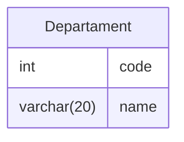
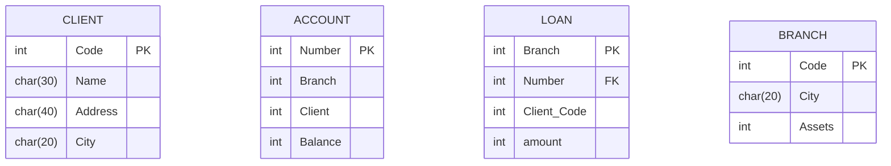

## Introduction

Our preliminary discussions have provided a glimpse into the essential tools and techniques required for effective manipulation and extraction of valuable information from databases. This guide serves as an invitation to enthusiasts and passionate individuals alike, beckoning them to explore the richness of SQL.

In the upcoming chapters, we will meticulously dissect specific SQL commands and practices, empowering you with the knowledge and skills needed to proficiently manage and query databases. Whether you are a newcomer eager to grasp the fundamentals or a seasoned practitioner looking to refine your techniques, our guide is tailored to enhance your SQL experience.

## Data Definition Language (DDL)

Data Definition Language (DDL) constitutes a specialized set of SQL instructions designed to facilitate the creation, alteration, and deletion of tables and indexes within a relational database. These commands are fundamental in defining and managing the structure of the database itself, shaping the way data is organized and accessed.



> ***Note:** Relational-model representation of the table Departament*

DDL enable database administrators and developers to define the structure, constraints, and relationships between data elements. The ability to create, alter, and delete tables and indexes empowers users to adapt the database schema to evolving requirements, ensuring a robust and well-defined foundation for data management.

As a result, DDL commands are crucial in establishing the framework that governs how data is organized, stored, and accessed within a relational database system.

# 

### Creating Tables

When creating tables in a database using SQL, the `CREATE TABLE` command is employed. The syntax typically involves specifying the **table name** (Table), the **field name** ($A_i$), and the **data type** of that field ($D_i$). 

```sql
CREATE TABLE TABLE (A1 D1, A2 D2, ... , An Dn);
```

> ***Note:** Table is the table name, Ai is the attribute of the field in table Table, and Di is the data type of the field Ai.*

This structure helps define the schema or structure of the database by outlining the properties of each field within the table.

For example, let's say we want to create a table named "Employees" with fields for employee `ID`, `name`, and `age`. The SQL statement could look like this:

```sql
CREATE TABLE Employees
(
    EmployeeID int,
    Name varchar(50),
    Age int
);
```

In this example:
- `Employees` is the table name (Table).
- `EmployeeID`, `Name`, and `Age` are the field names ($A_i$).
- `INT` and `VARCHAR(50)` are the data types ($D_i$) for the respective fields.

This `CREATE TABLE` statement establishes the blueprint for the "Employees" table, indicating the types of data that can be stored in each column. It's a fundamental step in the database design process and enables the system to enforce data integrity and structure.

A table is **initially created empty**, without any records. The `INSERT` command, which will be discussed later, is used to load data into the table.


**Create Table Using Another Table**

A copy of an existing table can also be created using `CREATE TABLE` command. 

The new table gets the same column definitions, and all columns or specific columns can be selected. 

```sql
CREATE TABLE new_table_name AS
    SELECT column1, column2, ... , columnN 
    FROM existing_table_name;
```

> ***Note:** If you create a new table using an existing table, the new table will be filled with the existing values from the old table.*

#

**Integrity Constraints**

Integrity constraints are a crucial aspect of database management systems, ensuring the accuracy, consistency, and reliability of the data stored within the system. These constraints define and enforce rules that the data must adhere to, preventing the introduction of inconsistencies or invalid information by users or external processes. 

Several types of integrity constraints exist, each serving a specific purpose in maintaining the overall quality and reliability of the database.

**Primary Key**

One essential integrity constraint is the Primary Key constraint. The primary key uniquely identifies each record (row) within a table, providing a means to distinguish one record from another. 

A primary key is typically composed of one or more fields in the table, and its values must be unique and cannot contain null values. This ensures that each record can be unequivocally identified and that there are no duplicate or missing key values.

```sql
CREATE TABLE Employees
(
    EmployeeID int NOT NULL PRIMARY KEY,
    Name varchar(50),
    Age int
);
```

> ***Note:** In Interbase, the use of the NOT NULL clause is mandatory for the field(s) of the primary key.*

Optionally, you can define the primary key after specifying all the attributes of the table. 

```sql
CREATE TABLE Employees
(
    EmployeeID int NOT NULL,
    Name varchar(50),
    Age int,
  PRIMARY KEY(registration)
);
```

When a table has a composite primary key consisting of more than one field, this approach is mandatory.

#

**Avoiding Null Values**

It is a common practice in database design to establish fields that must not contain null values, emphasizing the importance of mandatory data entry to maintain the overall integrity of the system. When a field is designated as mandatory, it implies that providing a value for that field is a requirement for each record in the database.

To achieve this, the `NOT NULL` clause is utilized in the SQL schema definition. This clause is placed after specifying the field, signaling to the database system that the corresponding attribute must always have a valid, non-null value. The purpose of this constraint is to prevent the occurrence of incomplete or missing information in critical fields.

```sql
CREATE TABLE Employees
(
    EmployeeID int NOT NULL PRIMARY KEY,
    Name varchar(50) NOT NULL,
    Age int
);
```

> ***Note:** If the user forgets to fill it in, the Database Management System (DBMS) will present an error message.*

By enforcing the `NOT NULL` constraint, database administrators can enhance data accuracy and consistency, as well as mitigate the risk of incomplete or unreliable information within the system. This approach contributes to the overall effectiveness of the database in supporting the intended business processes and applications.

#

**Avoiding Duplicate Values**

In certain situations, it may be necessary to ensure that the value stored in a field of a record is unique in relation to all other records in the table. In other words, there cannot be two records with the same value for a particular field. To implement this integrity constraint, the UNIQUE clause should be used after specifying a column.

The `UNIQUE` constraint ensures that the values in a specific column (or set of columns) must be unique across all records in the table. If an attempt is made to insert or update a record with a value that already exists in the designated column, the database management system will raise an error.

```sql
CREATE TABLE Products
(
    ProductID INT PRIMARY KEY,
    ProductName VARCHAR(50) UNIQUE,
    Price DECIMAL(10,2)
);
```

> ***Note:** In Interbase, the use of the NOT NULL clause is mandatory together with the UNIQUE clause.*

In this example, the `ProductName` column is marked as `UNIQUE`, indicating that each product must have a distinct name. If a user tries to insert a new product with a name that already exists in the "Products" table, the database system will prevent the operation and report a violation of the `UNIQUE` constraint.

By employing the `UNIQUE` constraint, data integrity is enhanced by avoiding the occurrence of duplicate values in critical fields, ensuring that each record is uniquely identifiable based on the specified criteria. 

#

**Defining Default Values**

It is possible to set a default value for a field by adding the `DEFAULT` clause to its definition. This clause allows automatic substitution of null values with a specified initial value. 


```sql
CREATE TABLE Employees
(
    EmployeeID INT PRIMARY KEY,
    FirstName VARCHAR(50) NOT NULL,
    LastName VARCHAR(50) NOT NULL,
    Department VARCHAR(30) DEFAULT 'Unknown'
);
```

The `Department` column is defined with a `DEFAULT` clause, specifying 'Unknown' as the default value. This means that if a user inserts a new record without providing a value for the `Department` field, the database system will automatically set it to 'Unknown'.

By using the `DEFAULT` clause, you can ensure that certain fields have predefined values when no explicit value is provided during data insertion. This can be particularly useful for improving data consistency and simplifying data entry processes.

#

**Ensuring Valid Values**

In database design, it's not uncommon to encounter scenarios where a field should only allow specific, predefined values. The `CHECK` clause becomes a valuable tool in such situations, enabling the definition of constraints that restrict the acceptable range of values for a particular field. This ensures that only valid and expected data is stored in the database.

The `CHECK` constraint involves specifying a condition or expression within the schema definition, and it is particularly useful when dealing with fields that should adhere to a finite set of values. This can include fields representing categorical data, such as grades, statuses, or enumerated types.


```sql
CREATE TABLE Employees
(
    StudentID INT PRIMARY KEY,
    FirstName VARCHAR(50) NOT NULL,
    LastName VARCHAR(50) NOT NULL,
    Department VARCHAR(30) CHECK (Department IN ('A', 'B', 'C', 'D', 'F')),
    Salary DECIMAL(10,2) CHECK (Salary > 1000)
);
```

> ***Note:** The CHECK constraint is not limited to enumerations; it can also involve more complex conditions based on business rules or specific criteria.*

In this example, the CHECK clause is applied to the `Department` column, ensuring that only the values $A$, $B$, $C$, $D$, or $F$ can be inserted into or updated for this field. If an attempt is made to introduce a different grade value, the database management system will reject the operation, preventing the storage of invalid or unexpected data.

This powerful feature acts as a gatekeeper for data integrity, enforcing predefined rules at the database level and contributing to the overall reliability and accuracy of the stored information.

#

**Referential Integrity**

Often, we want to ensure that the value stored in a specific field of a table is present in the primary key of another table. This attribute is known as a foreign key (**FOREIGN KEY**).

For example, the **Dept** field in the **Employee** table should contain the code of a department previously registered in the **Department** table. To ensure that this restriction is always upheld, the **REFERENCES** clause is used in defining the **Dept** field in the **Employee** table.

Thus, the **Dept** field in the **Employee** table is designated as a foreign key and will only be allowed to store values that are previously registered in the **Code** field of the **Department** table. This relationship between tables is known as referential integrity.

```sql
CREATE TABLE Department
(
    Code INT PRIMARY KEY,
    Name VARCHAR(50) NOT NULL
);
```

> ***Note:**  The Department table has the Code field as the primary key.*

Similar to the definition of the primary key, the foreign key can be specified after defining all the fields in the table.

```sql
CREATE TABLE Employee
(
    Enrollment INT PRIMARY KEY,
    Name VARCHAR(30) NOT NULL,
    ID INT,
    Gender CHAR(1),
    Dept INT,
    Address VARCHAR(50),
    City VARCHAR(20),
    Salary DECIMAL(10,2),
    FOREIGN KEY (Department) REFERENCES Department(Code)
);
```

The **Employee** table contains the **Dept** field as a foreign key, referencing the primary key **Code** of the **Department** table. This ensures that each value in the **Dept** field of the **Employee** table corresponds to a valid code in the **Department** table.

Thus, referential integrity is maintained, preventing the inclusion of invalid values in the **Dept** field of the **Employee** table and ensuring that the relationships between the tables are consistent and reliable.

#

### Removing a Table

The process of removing a table from an SQL database involves the use of the `DROP TABLE` command. This command is a powerful tool that irreversibly removes the entire table structure and all associated data, essentially eliminating all traces of the specified relation.

```sql
DROP TABLE TableName;
```

Executing this command results in the complete removal of the specified table and its contents from the database. It is essential to exercise caution when using the DROP TABLE command, as there is no way to recover the data once the table has been dropped.

It is advisable to perform a backup or ensure the removal of a table is intended before executing the `DROP TABLE` command, as unintended use can lead to data loss. This command is a powerful administrative tool and should be used with care to maintain the integrity of the database.

#

### Modifying a Table

The `ALTER TABLE` command in SQL serves as a versatile tool for making adjustments to the structure of an existing table. This command empowers database administrators and developers to modify various aspects of a table, including adding new columns, removing existing ones, and altering the properties of columns.

Here are some common use cases for the `ALTER TABLE` command:

**Adding Columns**
```sql
ALTER TABLE TableName
  ADD ColumnName DataType;
```
> ***Note:** This query allows you to add a new column to the specified table.*

**Dropping Columns**
```sql
ALTER TABLE TableName
  DROP COLUMN ColumnName;
```
> ***Note:** Use this query to remove a column from the table.*

**Modifying Column Data Types**
```sql
ALTER TABLE TableName
  ALTER COLUMN ColumnName NewDataType;
```

> ***Note:** This query allows you to change the data type of an existing column.*

**Renaming Table**
```sql
ALTER TABLE TableName
  RENAME COLUMN ColumnName to newColumnName;
```
> ***Note:** This query allows you to rename a table.*

It's crucial to note that the specific syntax may vary slightly depending on the SQL database management system being used (e.g., MySQL, PostgreSQL, SQL Server). The `ALTER TABLE` command provides flexibility in adapting and evolving the database schema to meet changing requirements without the need to recreate the entire table.

#

### Indexes

Indexes are essential components in a database designed to accelerate data access and optimize query performance. 

An index can be associated with a single column or a combination of multiple columns, facilitating quick retrieval of specific records from a table. Once an index is created, all changes made to the table are automatically reflected in the index, maintaining data consistency.

The creation and removal of indexes are handled by two primary SQL statements: `CREATE INDEX` and `DROP INDEX`.

**Creating Indexes**

The CREATE INDEX statement is used to create indexes on a table. This statement requires the definition of a name for the index to be created, followed by the table name, and finally, a list containing the names of the attributes that compose the index.

```sql
CREATE INDEX IndexName
  ON TableName (Attribute1, Attribute2, ...);
```

Example:

```sql
CREATE INDEX idx_name ON Employee (Name);
```

In this example, an index named **idx_name** is being created on the **Employee** table based on the **Name** attribute. This results in an index that speeds up the search for specific records in the table, utilizing the index associated with the **Name** column.

Indexes play a crucial role in optimizing query performance, especially in large tables, providing more efficient data retrieval. However, it's important to balance the creation of indexes, as an excessive number of indexes can impact the performance of update and insert operations.

**There are two main reasons to use indexes in a database:**

- **Preventing Duplicate Data and Enhancing Integrity:** The use of the `UNIQUE` clause when creating indexes helps prevent duplicate data, reinforcing the integrity of the database. When an index is created with the `UNIQUE` clause, it prohibits two rows in the table from having the same value in the indexed attribute or set of attributes. This promotes data consistency, ensuring that each value is unique, which is crucial for maintaining referential integrity and data quality.

  ```sql
  CREATE UNIQUE INDEX idx_name
    ON Employee (Name);
  ```
     
- **Improving Database Speed:** Creating indexes that are relevant to the most common and frequent queries in the database can significantly increase query speed. By creating indexes on columns often used in WHERE, JOIN, or ORDER BY clauses, the database can efficiently locate the desired records, reducing the time required to perform specific queries.

**Considerations on Index Usage:**
- **Caution in Creation:** While indexes can improve query speed, it's essential to exercise caution in their creation. There are no strict limits on the quantity of indexes that can be created, but excessive indexing can consume disk space and may not always optimize queries, as there is no control over how the data will be accessed.

- **Disk Space:** Indexes occupy disk space, and the decision to create an index should consider the balance between the expected benefit in query speed and the cost in terms of additional storage.

- **Impact on Updates:** It's important to consider the impact of indexes on update operations, such as inserts, updates, and deletes. Additional indexes can affect the performance of these operations.

The use of indexes can increase query speed; however, caution must be exercised in creating these indexes. There are no limits regarding the quantity of indexes that can be created. Nevertheless, it is known that they occupy disk space and do not always optimize queries because there is no control over how the data will be accessed.

#

**Removing Indexes**

To remove indexes, the `DROP INDEX` statement is employed. This statement allows for the elimination of previously created indexes on specific columns or combinations of columns in a table.

```sql
DROP INDEX IndexName;
```

This action revokes the indexing structure on the specified column or columns, and queries will no longer benefit from the accelerated data retrieval provided by that particular index.

It's crucial to exercise caution when removing indexes, as doing so may impact the performance of queries that relied on those indexes for speedy data access. Additionally, consider the potential consequences on write operations (inserts, updates, deletes) when deciding to remove indexes, as these operations might be influenced by the presence or absence of certain indexes.

## Data Manipulation Language (DML)

Data Manipulation Language (DML) constitutes a critical aspect of Structured Query Language (SQL), focusing specifically on the manipulation and management of data within a relational database. DML commands empower users to interact with the data stored in tables, providing a versatile set of operations that include inserting new data, updating existing records, selecting specific information, and deleting data when necessary.

<table align="center">
  <tr>
    <th>StudentID</th>
    <th>Name</th>
    <th>Grade</th>
    <th>Class</th>
    <th>Address</th>
  </tr>
  <tr>
    <td>112121</td>
    <td>Maria Pereira</td>
    <td>2</td>
    <td>A</td>
    <td>Pio XII Street</td>
  </tr>
  <tr>
    <td>524271</td>
    <td>Ryan Cullen</td>
    <td>3</td>
    <td>B</td>
    <td>Straight Street</td>
  </tr>
  <tr>
    <td>321233</td>
    <td>Rui Barros</td>
    <td>1</td>
    <td>B</td>
    <td>Edson Street</td>
  </tr>
  <tr>
    <td>453627</td>
    <td>Ivo Pitanga</td>
    <td>3</td>
    <td>A</td>
    <td>Round Square</td>
  </tr>
</table>

> ***Note:** Table Students*

They provide users, including database administrators and application developers, with the capability to maintain data accuracy, perform updates, retrieve specific information, and remove obsolete records. The flexible nature of DML commands ensures that databases can adapt to evolving needs, making them a cornerstone in ensuring the integrity and relevance of data within an information system.

### Inserting Records

To add new data records to a table within a relational database, the SQL `INSERT INTO` command is employed. This command enables the explicit specification of values for each field of the record being added. Suppose we want to insert a student with the following data:

<table align = "center">
  <tr>
    <td>123251</td>
    <td>John Smith</td>
    <td>3</td>
    <td>B</td>
    <td>Main Street</td>
  </tr>
</table>

This `INSERT INTO` statement adds a new student record to the **Students** table, providing specific values for each corresponding column. 

```sql
INSERT INTO TABLE Students (StudentID, Name, Series, Class, Address) VALUES (123251, 'John Smith', 3, 'B', 'Main Street');
```

> ***Note:** In this example, the values are specified in the order in which the fields were defined in the table.*

In cases where the user might not recall the order of the attributes, it is permissible to specify the attributes as part of the `INSERT` statement.

```sql
INSERT INTO TABLE Students (Name, StudentID, Series, Address, Class) VALUES ('John Smith', 123251, 3, 'Main Street', 'B');
```

The flexibility of the `INSERT INTO` command allows for the seamless addition of diverse data into a database, providing a dynamic and adaptable mechanism for populating tables with relevant information.

#

### Removing Records

The process of eliminating records from a table is carried out using the `DELETE` statement in SQL. This statement is a fundamental component of Data Manipulation Language (DML) and provides a means to selectively remove specific rows based on specified conditions. Let's delve into a more comprehensive explanation:

```sql
DELETE FROM TableName WHERE Condition;
```

> ***Note:** If no condition is specified, all records from the table will be removed.*

For example, if we want to remove a student with a certain StudentID from a hypothetical **Students** table:

```sql
DELETE FROM Students
  WHERE StudentID = 123251;
```

> ***Note:** In this scenario, the student record with the StudentID 101 will be removed.*

It's crucial to exercise caution when using the `DELETE` statement, especially when a condition is not specified, as it can result in the removal of all records from the table. 

Additionally, it's recommended to use conditions that precisely target the records intended for removal to avoid unintended data loss.

```sql
DELETE FROM Students;
```

> ***Note:** In this scenario, all students records will be removed.*

The `DELETE` statement is a powerful tool for managing data within a relational database, allowing users to efficiently remove records that are no longer needed or that meet specific criteria.

#

### Modifying Records

To modify the value of a field for a specific record or for records that meet a particular condition, the `UPDATE` statement is employed in SQL. Let's expand on this concept using the example where the student Ryan Cullen (StudentID = 524271) will be transferred to the fourth grade.

```sql
UPDATE Students
  SET Grade = 4
  WHERE StudentID = 524271;
```

In this example:
- **Field to be Updated (SET):** The "Grade" field will be updated.
- **New Value:** 4 (indicating the fourth grade).
- **Condition (WHERE):** The update will only be applied to the record where the StudentID is equal to 524271.

Suppose now that all students from the third grade B will be transferred to the fourth grade.

```sql
UPDATE Students
  SET Grade = 4
  WHERE StudentID = 524271 AND Class = 'B';
```

This `UPDATE` statement ensures that the information about José da Silva in the "Students" table reflects his transfer to the fourth grade. The flexibility of the `UPDATE` statement allows for precise modifications to specific records or a set of records based on defined conditions, providing a powerful mechanism for managing and updating data within a relational database.

#

### Querying Datas

When querying data in a database using the Data Manipulation Language (DML), the primary command is the `SELECT-FROM-WHERE` statement. This compound SQL statement allows users to retrieve specific information from one or more tables based on specified conditions. 

<table align = "center">
<tr align = "center">
    <th>Students</th>
    <th>Grades</th>
</tr>
<tr>
<td>
  
<table>
    <thead>
        <tr>
            <th>StudentID</th>
            <th>FirstName</th>
            <th>LastName</th>
            <th>Age</th>
        </tr>
    </thead>
    <tbody align = "center">
        <tr>
            <td>1</td>
            <td>John</td>
            <td>Doe</td>
            <td>20</td>
        </tr>
        <tr>
            <td>2</td>
            <td>Jane</td>
            <td>Smith</td>
            <td>22</td>
        </tr>
        <tr>
            <td>3</td>
            <td>Robert</td>
            <td>Johnson</td>
            <td>21</td>
        </tr>
        <tr>
            <td>4</td>
            <td>Emily</td>
            <td>Williams</td>
            <td>23</td>
        </tr>
    </tbody>
</table>


</td>

<td >

<table>
    <thead>
        <tr>
            <th>GradeID</th>
            <th>StudentID</th>
            <th>Exam</th>
            <th>Score</th>
        </tr>
    </thead>
    <tbody align = "center">
        <tr>
            <td>1</td>
            <td>1</td>
            <td>Midterm</td>
            <td>68</td>
        </tr>
        <tr>
            <td>2</td>
            <td>2</td>
            <td>Midterm</td>
            <td>85</td>
        </tr>
        <tr>
            <td>3</td>
            <td>3</td>
            <td>Midterm</td>
            <td>92</td>
        </tr>
        <tr>
            <td>4</td>
            <td>4</td>
            <td>Midterm</td>
            <td>78</td>
        </tr>
    </tbody>
</table>

</td>
</tr> 
</table>

**SELECT Clause**  
The `SELECT` clause corresponds to the projection operation in relational algebra. It determines the columns or fields that will be included in the result set of the query. Users can select specific columns or apply aggregate functions to derive calculated values.

**Example:**  
```sql
SELECT FirstName, LastName, Age
```

> ***Note:** This query through the SELECT clause, is selecting the FirstName, LastName, and Age attributes from a table.*

**FROM Clause**  
The `FROM` clause specifies the tables involved in the query and establishes the relationships between them. It corresponds to the Cartesian product in relational algebra. Tables are joined based on common columns to create a combined dataset for the query.

**Example:**  
```sql
FROM Students
    JOIN Grades ON Students.StudentID = Grades.StudentID
```

> ***Note:** The JOIN clause is connecting the Students table with the Grades table based on the common StudentID attribute.*

**WHERE Clause**  
The `WHERE` clause corresponds to the selection operation in relational algebra. It introduces conditions that filter the rows from the result set. Only rows that satisfy the specified conditions are included in the final output.

**Example:**  
```sql
WHERE Grades.Exam = 'Midterm' AND Grades.Score > 70
```

> ***Note:** The WHERE clause filters the results by Grades table where the Exam is Midterm and the Score is greater than 70.*

Combining these clauses, a comprehensive `SELECT-FROM-WHERE` statement might look like the following:


```sql
SELECT FirstName, LastName, Age
    FROM Students
    JOIN Grades ON Students.StudentID = Grades.StudentID
    WHERE Grades.Exam = 'Midterm' AND Grades.Score > 70;
```

> ***Note:** This is an example of a typical use of queries.*

<table align = "center">
    <tbody>
        <tr>
            <td>Jane</td>
            <td>Smith</td>
            <td>22</td>
        </tr>
        <tr>
            <td>Robert</td>
            <td>Johnson</td>
            <td>21</td>
        </tr>
        <tr>
            <td>Emily</td>
            <td>Williams</td>
            <td>23</td>
        </tr>
    </tbody>
</table>

In this example, the query retrieves the *first name*, *last name*, and *age* of students who scored **above 70** on the midterm exam, utilizing the **Students** and **Grades** tables and joining them based on the common **StudentID**. The `SELECT-FROM-WHERE` statement provides a powerful mechanism for extracting targeted information from a database, supporting a wide range of data analysis and reporting needs.

The condition (or predicate) that follows the `WHERE` clause can contain comparison operators such as:

- `=` (Equal)
- `>` (Greater than)
- `<` (Less than)
- `<>` (Not equal)
- `>=` (Greater than or equal to)
- `<=` (Less than or equal to)


Additionally, boolean operators can be used to combine multiple conditions:

- `AND`: Returns true if both conditions are true.
- `OR`: Returns true if at least one of the conditions is true.
- `NOT`: Negates the result of a condition.

These operators allow for the formulation of complex conditions that help filter and retrieve specific subsets of data from the database based on various criteria. Here's an example:

```sql
SELECT FirstName, LastName, Age
    FROM Students
    WHERE Grade = 'A' AND Age >= 18;
```

In this example, the query selects the first name, last name, and age of students who have received an $A$ grade and are 18 years old or older. The use of comparison and boolean operators in the `WHERE` clause enables the creation of precise conditions for data retrieval.

The `WHERE` clause can be omitted, and the list of attributes ($A1, A2, ...$) can be replaced by an asterisk ($*$) to select all fields from all tables listed in the `FROM` clause. This approach is useful when you want to retrieve all data from one or more tables without applying specific conditions. Here's an example:

```sql
SELECT *
    FROM Students;
```

#

### Eliminating Duplicate Results

In formal query languages, the foundation is grounded in mathematical concepts, particularly those related to relations. These languages, such as SQL (Structured Query Language), adhere to principles where duplicate records are not expected to be present in query results. However, the SQL language, while formal and powerful, does not inherently eliminate duplicate records from query results by default. 

The presence of duplicate records in query results might occur due to various reasons, such as complex joins, or when querying data from multiple tables. To address this and retrieve a distinct set of records, the `DISTINCT` keyword comes into play.

```sql
SELECT DISTINCT column1, column2, ...
    FROM TableName
    WHERE conditions;
```

> ***Note:** The DISTINCT keyword ensures that only unique combinations of the specified columns are included in the result set.*

By incorporating the `DISTINCT` keyword after the `SELECT` clause in an SQL query, users can instruct the database to filter out duplicate records, providing a unique set of results. 

A SQL allows the use of the word `ALL` to explicitly specify that we do not want duplicates to be removed.

```sql
SELECT ALL Attribute FROM TableName
```

Since duplicating the resulting records is the default behavior, the use of the `ALL` clause becomes optional.

#

### Sorting the Result of a Query

In SQL, the `ORDER BY` clause is a powerful tool that allows you to control the order in which the results of a query are presented. This clause is particularly useful when you want to organize the output in a specific sequence based on one or more columns.

Here's a breakdown of how the `ORDER BY` clause is used:

```sql
SELECT column1, column2, ...
    FROM TableName
    WHERE conditions
    ORDER BY column1 [ASC | DESC], column2 [ASC | DESC], ...;
```

> **Note:** ASC (Ascending) is the default, but you can use DESC (Descending) for reverse order.*

Example:

```sql
SELECT FirstName, LastName, Age
    FROM Students
    ORDER BY Age DESC, LastName ASC;
```

In this example:
- The query selects the first name, last name, and age from the **Students** table.
- The result set is ordered first by age in *descending order* (oldest to youngest), and then by last name in *ascending order* (alphabetically).

The `ORDER BY` clause allows you to sort the rows of the query result in ascending or descending order. When used, the `ORDER BY` clause should always appear in the last line of the query.

#

### Join Operations

SQL provides various types of join operations to combine rows from two or more tables based on related columns. The commonly used join operations include `INNER JOIN`, `LEFT JOIN`, `RIGHT JOIN`, and `FULL 
JOIN`.

For this topic, we will use the following tables to exemplify join operations:

<table align = "center">
<tr align = "center">
    <th>Left Table (A)</th>
    <th>Right Table (B)</th>
    <th>Right Table (C)</th>
    <th>Right Table (D)</th>
    <th>Right Table (E)</th>
</tr>
<tr>
<td>
<table>
    <thead>
        <tr>
            <th>Date</th>
            <th>countryID</th>
            <th>Units</th>
        </tr>
    </thead>
    <tbody align = "center">
        <tr>
            <td>1/1/2020</td>
            <td>1</td>
            <td>40</td>
        </tr>
        <tr>
            <td>1/2/2020</td>
            <td>1</td>
            <td>25</td>
        </tr>
        <tr>
            <td>1/3/2020</td>
            <td>2</td>
            <td>30</td>
        </tr>
        <tr>
            <td>1/4/2020</td>
            <td>3</td>
            <td>35</td>
        </tr>
    </tbody>
</table>

</td>
<td >
<table>
    <thead>
        <tr>
            <th>ID</th>
            <th>Country</th>
        </tr>
    </thead>
    <tbody align = "center">
        <tr>
            <td>1</td>
            <td>USA</td>
        </tr>
        <tr>
            <td>2</td>
            <td>China</td>
        </tr>
        <tr>
            <td>3</td>
            <td>Brazil</td>
        </tr>
    </tbody>
</table>
</td>

</td>
<td >
<table>
    <thead>
        <tr>
            <th>ID</th>
            <th>Country</th>
        </tr>
    </thead>
    <tbody align = "center">
        <tr>
            <td>3</td>
            <td>Brazil</td>
        </tr>
    </tbody>
</table>
</td>

</td>
<td >
<table>
    <thead>
        <tr>
            <th>ID</th>
            <th>Country</th>
        </tr>
    </thead>
    <tbody align = "center">
        <tr>
            <td>1</td>
            <td>USA</td>
        </tr>
        <tr>
            <td>2</td>
            <td>China</td>
        </tr>
        <tr>
            <td>3</td>
            <td>Brazil</td>
        </tr>
        <tr>
          <td>4</td>
          <td>Spain</td>
        </tr>
    </tbody>
</table>
</td>

</td>
<td >
<table>
    <thead>
        <tr>
            <th>ID</th>
            <th>Country</th>
        </tr>
    </thead>
    <tbody align = "center">
        <tr>
            <td>3</td>
            <td>Brazil</td>
        </tr>
        <tr>
          <td>4</td>
          <td>Spain</td>
        </tr>
    </tbody>
</table>
</td>


</tr> 
</table>

#

**INNER JOIN**  
The `INNER JOIN` operation returns rows that have matching values in both tables based on the specified condition in the ON clause.

**Example:**
```sql
SELECT column1, column2, ...
  FROM table1
  INNER JOIN table2 ON table1.column = table2.column;
```

> ***Note:** This returns only the rows where there is a match between the specified columns in both tables.*

Let's take a practical example for better illustration:

```sql
SELECT Date, countryID, Units, Country
  FROM A
  INNER JOIN E ON A.countryID = E.ID;
```

<table>
    <thead>
        <tr>
            <th>Date</th>
            <th>countryID</th>
            <th>Units</th>
            <th>Country</th>
        </tr>
    </thead>
    <tbody align = "center">
        <tr>
            <td>1/4/2020</td>
            <td>3</td>
            <td>35</td>
            <td>Brazil</td>
        </tr>
    </tbody>
</table>


#

**LEFT JOIN (or LEFT OUTER JOIN)**  
The `LEFT JOIN` operation returns all rows from the left table and the matching rows from the right table. If there is no match, NULL values are returned for columns from the right table.

**Example:**  
```sql
SELECT column1, column2, ...
  FROM table1
  LEFT JOIN table2 ON table1.column = table2.column;
```
> ***Note:** This ensures that all rows from the left table are included, and matching rows from the right table are added where applicable.*

Let's take a practical example for better illustration:

```sql
SELECT Date, countryID, Units, Country
  FROM A
  LEFT JOIN B ON A.countryID = B.ID;
```

<table>
    <thead>
        <tr>
            <th>Date</th>
            <th>countryID</th>
            <th>Units</th>
            <th>Country</th>
        </tr>
    </thead>
    <tbody align = "center">
        <tr>
            <td>1/1/2020</td>
            <td>1</td>
            <td>40</td>
            <td>USA</td>
        </tr>
        <tr>
            <td>1/2/2020</td>
            <td>1</td>
            <td>25</td>
            <td>USA</td>
        </tr>
        <tr>
            <td>1/3/2020</td>
            <td>2</td>
            <td>30</td>
            <td>China</td>
        </tr>
        <tr>
            <td>1/4/2020</td>
            <td>3</td>
            <td>35</td>
            <td>Brazil</td>
        </tr>
    </tbody>
</table>

#

**RIGHT JOIN (or RIGHT OUTER JOIN)**  
The `RIGHT JOIN` operation returns all rows from the right table and the matching rows from the left table. If there is no match, NULL values are returned for columns from the left table.

**Example:**
```sql
SELECT column1, column2, ...
  FROM table1
  RIGHT JOIN table2 ON table1.column = table2.column;
```
> ***Note:** This ensures that all rows from the right table are included, and matching rows from the left table are added where applicable.*

Let's take a practical example for better illustration:

```sql
SELECT Date, countryID, Units, Country
  FROM A
  RIGHT JOIN C ON A.countryID = C.ID;
```

<table>
    <thead>
        <tr>
            <th>Date</th>
            <th>countryID</th>
            <th>Units</th>
            <th>Country</th>
        </tr>
    </thead>
    <tbody align = "center">
        <tr>
            <td>1/4/2020</td>
            <td>3</td>
            <td>35</td>
            <td>Brazil</td>
        </tr>
    </tbody>
</table>

#

**FULL JOIN (or FULL OUTER JOIN)**  
The `FULL JOIN` operation returns all rows when there is a match in either the left or right table. If there is no match, NULL values are returned for columns from the non-matching side.

**Example:**  
```sql
SELECT column1, column2, ...
  FROM table1
  FULL JOIN table2 ON table1.column = table2.column;
```
> ***Note:** This combines the results of both tables, including matching rows and filling in NULL values for non-matching columns.*

Let's take a practical example for better illustration:

```sql
SELECT Date, countryID, Units, Country
  FROM A
  FULL JOIN D ON A.countryID = D.ID;
```

<table>
    <thead>
        <tr>
            <th>Date</th>
            <th>countryID</th>
            <th>Units</th>
            <th>Country</th>
        </tr>
    </thead>
    <tbody align = "center">
        <tr>
            <td>1/1/2020</td>
            <td>1</td>
            <td>40</td>
            <td>USA</td>
        </tr>
        <tr>
            <td>1/2/2020</td>
            <td>1</td>
            <td>25</td>
            <td>USA</td>
        </tr>
        <tr>
            <td>1/3/2020</td>
            <td>2</td>
            <td>30</td>
            <td>China</td>
        </tr>
        <tr>
            <td>1/4/2020</td>
            <td>3</td>
            <td>35</td>
            <td>Brazil</td>
        </tr>
        <tr>
            <td>NULL</td>
            <td>NULL</td>
            <td>NULL</td>
            <td>Spain</td>
        </tr>
    </tbody>
</table>


These join operations allow you to retrieve data from multiple tables based on specified conditions, enabling the creation of comprehensive result sets. Each join type serves different purposes depending on the desired outcome of the query.

## Predicates


SQL allows for queries that combine information from different tables, making it easy to retrieve specific data. 



> ***Note:** PK (Primary Key) and FK (Foreign Key).*

The following query aims to *"Present the account number(s) and the respective balance of customers who have loans":*

```sql
SELECT ACCOUNT.Number, ACCOUNT.Balance
  FROM LOAN
  JOIN ACCOUNT ON LOAN.Client_Code = ACCOUNT.Client;
```

> ***Note**: This query exemplifies SQL's capability to combine information from different tables, enabling more comprehensive and effective analysis.*

In this query, we use the JOIN clause to combine data from the `LOAN` and `ACCOUNT` tables based on the condition `LOAN.Client_Code = ACCOUNT.Client`. The `SELECT` statement specifies the attributes we want to retrieve, namely the account number (`ACCOUNT.Number`) and the corresponding balance (`ACCOUNT.Balance`) for customers who have loans.

The `relation.attribute` notation is employed to avoid ambiguities, ensuring clarity when referencing attributes present in multiple tables. In this case, we could have written `LOAN.balance` instead of `ACCOUNT.Balance` in the `SELECT` clause, but we chose to use the balance from the `ACCOUNT` table, where the relationship is established.

By explicitly denoting the relation along with the attribute, SQL guarantees precise interpretation and execution of the query. This becomes especially crucial when dealing with complex database structures where attribute names may overlap across different tables. In such cases, the `relation.attribute` notation becomes instrumental in providing a clear and unequivocal reference to the intended attribute, contributing to the overall accuracy and reliability of SQL queries.

SQL uses the `relation.attribute` notation to avoid ambiguities, ensuring clarity in cases where an attribute is present in the schema of multiple relations. In the example presented, we could have written `ACCOUNT.Balance` instead of simply `Balance` in the SELECT clause. However, since the attribute `Balance` is present in only one of the relations referenced in the FROM clause (specifically, the `ACCOUNT` table), there is no ambiguity when using just `Balance`.

To illustrate, we consider a new query that seeks information about customers with accounts having a balance exceeding 50,000:

```sql
SELECT CLIENT.Name, ACCOUNT.Balance
  FROM CLIENT
  JOIN ACCOUNT ON CLIENT.Code = ACCOUNT.Number
  WHERE ACCOUNT.Balance > 50000;
```

In this query: 
- We use `JOIN` to connect the `cliente` and `conta` tables based on corresponding key relationships.
- The `SELECT` clause specifies which attributes we want to retrieve, using the `relation.attribute` notation for clarity.
- The `WHERE` clause includes a condition that uses the comparison operator `>` to filter accounts with balances above 50,000.

#

The query *"Present the name and city of customers with a loan at the New York Branch"* can be expressed as follows:

```sql
SELECT CLIENT.Name, CLIENT.City
  FROM LOAN
  JOIN CLIENT ON LOAN.Client_Code = CLIENT.Code
  WHERE LOAN.Branch = 'New York';
```

The SQL language allows the use of logical connectors such as `AND`, `OR`, and `NOT`. Additionally, it supports arithmetic expressions with operators like +, -, *, and /.

A SQL also includes a comparison operator, `BETWEEN`, to simplify WHERE clauses specifying that a value should be between a certain range. If we want to find the account numbers with a balance between 90,000 and 100,000, we can use the `BETWEEN` clause:

```sql
SELECT Number
  FROM ACCOUNT
  WHERE Balance BETWEEN 90000 AND 100000;
```

This is equivalent to the following alternative:

```sql
SELECT Number
  FROM ACCOUNT
  WHERE Balance >= 90000 AND Balance <= 100000;
```

Similarly, you can use the `NOT BETWEEN` comparison operator to find records outside a specified range.

#

A SQL includes a string substitution operator for string comparisons. Patterns are described using two special characters:

- `%` (percent) Replaces any substring.
- `_` (underscore) Replaces any single character.

Patterns are case-sensitive; that is, uppercase characters do not replace lowercase characters, and vice versa. To illustrate pattern substitution, consider the following examples:

- `'Jose%'` replaces any string starting with "Jose".
- `'%ari%'` replaces any string containing "ari" as a substring, for example, "Maria", "Mariana", "Itaparica".
- `___` replaces any string with exactly three characters.
- `___%` replaces any string with at least three characters.

  #

Patterns are expressed in SQL using the comparison operator `LIKE`. 

Consider the query: *"Present the names of all customers whose streets contain the substring 'Lima'."*

```sql
SELECT Name
  FROM CLIENT
  WHERE Adress LIKE '%Lima%';
```

To allow patterns to include the special characters `%` and `_`, the SQL language permits the specification of an escape character, represented by a user-defined character, for example, "\" (backslash). 

This way, the character after "\" is interpreted as a literal, not as a special character. For example:

- `LIKE 'ab\%cd%' ESCAPE '\'` represents strings starting with "ab%cd."
- `LIKE 'ab\\%cd%' ESCAPE '\'` represents strings starting with "ab\cd."

SQL also allows searching for non-substitution instead of substitution using the `NOT LIKE` comparison operator.

#

### Membership

The IN operator tests the membership of a set of values produced by a `SELECT` statement. Conversely, the `NOT IN` operator tests the absence of members from a set.

To present clients who have both an account and a loan at agency 38, we begin by identifying all account holders at agency 38:

```sql
SELECT Client
  FROM ACCOUNT
  WHERE Branch = 38;
```

Then, to find clients who are loan applicants at agency 38 and appear in the list of account holders at agency 38, we incorporate the above subquery into another SELECT:

```sql
SELECT Client
  FROM LOAN
  WHERE Branch = 38
    AND CLIENT IN (SELECT Client FROM ACCOUNT WHERE Branch = 38);
```

It's possible to write the same query in different ways in SQL, which is beneficial as it allows the user to think about the query in the way that seems most natural to them.

```sql
SELECT Client
  FROM LOAN
  WHERE Branch = 38
    AND (Branch, Client) IN (SELECT Branch, Client FROM ACCOUNT);
```

Now, we illustrate the use of the `NOT` operator in a construction to present all clients who have an account at agency 38 but do `NOT` have a loan at that same agency:

```sql
SELECT Client
  FROM ACCOUNT
  WHERE Branch = 38
    AND Client NOT IN (SELECT Client_Code FROM LOAN WHERE Branch = 38);
```

#

### Tuple Variables

Tuple variables in the SQL language need to be associated with a specific relation and are defined in the FROM clause. These variables are useful for comparing tuples within the same relation.

To illustrate, consider the following query:

```sql
-- Display the name and city of customers who have a loan

SELECT C.name, C.city
  FROM loan L, customer C
  WHERE L.customer = C.code;
```

In this query, `L` and `C` are tuple variables associated with the relations `loan` and `customer`, respectively. The variable `C` is defined in the FROM clause after the name of the relation it is associated with.

Tuple variables defined in a query are valid in subqueries of lower levels but are not visible to higher-level subqueries. If a tuple variable is defined locally in a subquery and globally in a query, the local definition takes precedence.

Tuple variables are particularly useful for comparing two tuples in the same relation. For example:

```sql
-- Which customers have an account at any branch where the customer with code 12345 has an account

SELECT DISTINCT C.customer
  FROM account C, account T
  WHERE C.customer = 12345
    AND C.branch = T.branch;
```

Note that we cannot use the notation `accounts.branch` in this case, as it would not be clear which reference to `accounts` is desired.

## Set Comparison 

Comparison operations in the SQL language involve various set operations such as `UNION`, `INTERSECT`, and `EXCEPT` (or `MINUS` in some implementations). These operations are essential for combining, finding the intersection, or determining the difference between result sets of different queries.

#

**UNION**

The `UNION` operation in SQL is a powerful tool that enables the combination of results from two or more queries into a single result set. This operation is particularly useful when dealing with similar structures across different datasets, allowing you to create a consolidated view. 

The key features of the `UNION` operation include the merging of results and automatic elimination of duplicate entries.

**Key Characteristics:**

**Combining Results:**
- The primary purpose of the `UNION` operation is to merge the results of multiple queries.
- It allows you to bring together data from different tables or sources, creating a unified dataset.

**Single Result Set:**
- The final output of the `UNION` operation is a single result set that includes all distinct rows from the combined queries.

**Automatic Duplicate Elimination:**
- One significant advantage of using `UNION` is its ability to automatically eliminate duplicate entries from the result set.
- This ensures that each unique record appears only once in the final output.

**Example: Combining Clients from Loans and Accounts:**

Consider the following SQL query that utilizes the `UNION` operation to select all clients from the `loan` and `account` tables:

```sql
-- Selects all clients from loans and accounts

SELECT client FROM loan
  UNION
  SELECT client FROM account;
```

> ***Note:** The resulting output is a consolidated list of clients from both tables, ensuring uniqueness.*

The `UNION` operation is a valuable tool in SQL for merging and consolidating data, providing a streamlined approach to handle diverse datasets. It is widely used in scenarios where data integration and a unified view are essential.

#

**INTERSECT**  
The `INTERSECT` operation in SQL is designed to retrieve records that are common to two or more queries. This operation facilitates the identification of shared elements between datasets, allowing for a more focused analysis. 

The primary features of the `INTERSECT` operation include the extraction of common records and the automatic elimination of duplicate entries.

**Key Characteristics:**

**Common Record Retrieval:**
- The primary purpose of the `INTERSECT` operation is to identify and retrieve records that exist in the results of multiple queries.
- It focuses on extracting data points that are present in all specified queries.

**Single Result Set:**
- Similar to the `UNION` operation, the `INTERSECT` operation produces a single result set containing only the records common to all involved queries.

**Automatic Duplicate Elimination:**
- One of the advantages of using `INTERSECT` is its ability to automatically eliminate duplicate entries from the result set.
- This ensures that each unique record appears only once in the final output.

**Example: Identifying Clients with Both Loans and Accounts:**

Consider the following SQL query that utilizes the `INTERSECT` operation to select clients who have both loans and accounts:

```sql
-- Selects clients who have both loans and accounts

SELECT client FROM loan
  INTERSECT
  SELECT client FROM account;
```

In summary, the `INTERSECT` operation is a valuable SQL tool for identifying and extracting common records from multiple queries. It contributes to a more focused and precise data analysis by emphasizing shared elements between datasets.

#

**EXCEPT (or MINUS in some implementations):**  

The `EXCEPT` operation in SQL is employed to retrieve records from the first query that are not present in subsequent queries. It helps in identifying elements unique to the initial dataset by excluding those found in subsequent datasets. 

The `EXCEPT` operation can be used to compare and contrast different datasets, highlighting distinctions in the data. It provides flexibility in terms of including or excluding duplicate entries based on the specific implementation.

**Key Characteristics:**

**Exclusive Record Retrieval:**
- The primary function of the `EXCEPT` operation is to return records that are exclusive to the first query, excluding those found in the subsequent queries.
- It focuses on isolating elements unique to the initial dataset.

**Single Result Set:**
- Similar to the `UNION` and `INTERSECT` operations, the `EXCEPT` operation produces a single result set containing the records exclusive to the first query.

**Handling Duplicates:**
- The behavior regarding duplicates in the result set may vary depending on the specific implementation of SQL.
- Some implementations automatically eliminate duplicates, while others may include them in the output.

**Example: Identifying Clients with Accounts but Not Loans:**

Consider the following SQL query that utilizes the `EXCEPT` operation to select clients who have accounts but not loans:

```sql
-- Selects clients who have accounts but not loans

SELECT client FROM account
  EXCEPT
  SELECT client FROM loan;
```

The `EXCEPT` operation in SQL is a versatile tool for identifying exclusive records in the first query when compared to subsequent queries. It plays a crucial role in data comparison and analysis by highlighting distinctions and providing insights into unique elements within datasets.

These set operations are valuable when performing comparisons or combining data sets from different SQL queries.


#

### Testing Empty Relations

SQL provides the `EXISTS` and `NOT EXISTS` constructions to assess the presence or absence of tuples in subqueries. These constructions return `true` if the result of the subquery is not empty and are valuable for conditional queries.

**Example: Clients with Both Account and Loan at Agency 17:**
```sql
SELECT name
FROM client
WHERE EXISTS (
    SELECT *
    FROM account
    WHERE account.client = client.code
    AND agency = 17
)
AND EXISTS (
    SELECT *
    FROM loan
    WHERE loan.client = client.code
    AND agency = 17
);
```

In this query:
- The outermost `SELECT` statement retrieves the names of clients who meet the specified conditions.
- The first `EXISTS` subquery, nested within the `WHERE` clause, checks for the existence of any records in the `account` table where the client code matches the client's code from the outer query, and the agency is 17. This ensures that the client has an account at the Ipiranga agency.
- The second `EXISTS` subquery performs a similar check but focuses on the `loan` table, verifying whether the client has a loan at the Ipiranga agency.

The use of `EXISTS` is particularly relevant in this scenario. It returns `true` if the specified subquery returns any rows, indicating that there is a match. Consequently, the combined conditions of both `EXISTS` subqueries ensure that only clients with both an account and a loan at agency 17 are included in the final result.

This type of query is valuable in scenarios where you want to find clients who have multiple related records in different tables, allowing for a comprehensive analysis of client interactions with the specified agency. It's essential to ensure that the column names and data types align between the subqueries and the main query for accurate execution. Additionally, be mindful of potential performance considerations, as subqueries can impact query execution time.


