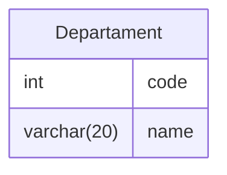

## Introduction


## Data Definition Language (DDL)

Data Definition Language (DDL) is a specific set of SQL instructions that provides a means for creating, altering, and deleting tables and indexes.



# 

### Creating Tables

When creating tables in a database using SQL, the `CREATE TABLE` command is employed. The syntax typically involves specifying the **table name** (Table), the **field name** ($A_i$), and the **data type** of that field ($D_i$). 

```sql
CREATE TABLE TABLE (A1 D1, A2 D2, ... , An Dn);
```

> ***Note:** Table is the table name, Ai is the attribute of the field in table Table, and Di is the data type of the field Ai.*

This structure helps define the schema or structure of the database by outlining the properties of each field within the table.

For example, let's say we want to create a table named "Employees" with fields for employee `ID`, `name`, and `age`. The SQL statement could look like this:

```sql
CREATE TABLE Employees
(
    EmployeeID int,
    Name varchar(50),
    Age int
);
```

In this example:
- `Employees` is the table name (Table).
- `EmployeeID`, `Name`, and `Age` are the field names ($A_i$).
- `INT` and `VARCHAR(50)` are the data types ($D_i$) for the respective fields.

This `CREATE TABLE` statement establishes the blueprint for the "Employees" table, indicating the types of data that can be stored in each column. It's a fundamental step in the database design process and enables the system to enforce data integrity and structure.

A table is **initially created empty**, without any records. The `INSERT` command, which will be discussed later, is used to load data into the table.


**Create Table Using Another Table**

A copy of an existing table can also be created using `CREATE TABLE` command. 

The new table gets the same column definitions, and all columns or specific columns can be selected. 

```sql
CREATE TABLE new_table_name AS
    SELECT column1, column2, ... , columnN 
    FROM existing_table_name;
```

> ***Note:** If you create a new table using an existing table, the new table will be filled with the existing values from the old table.*

#

**Integrity Constraints**

Integrity constraints are a crucial aspect of database management systems, ensuring the accuracy, consistency, and reliability of the data stored within the system. These constraints define and enforce rules that the data must adhere to, preventing the introduction of inconsistencies or invalid information by users or external processes. 

Several types of integrity constraints exist, each serving a specific purpose in maintaining the overall quality and reliability of the database.

**Primary Key**

One essential integrity constraint is the Primary Key constraint. The primary key uniquely identifies each record (row) within a table, providing a means to distinguish one record from another. 

A primary key is typically composed of one or more fields in the table, and its values must be unique and cannot contain null values. This ensures that each record can be unequivocally identified and that there are no duplicate or missing key values.

```sql
CREATE TABLE Employees
(
    EmployeeID int NOT NULL PRIMARY KEY,
    Name varchar(50),
    Age int
);
```

> ***Note:** In Interbase, the use of the NOT NULL clause is mandatory for the field(s) of the primary key.*

Optionally, you can define the primary key after specifying all the attributes of the table. 

```sql
CREATE TABLE Employees
(
    EmployeeID int NOT NULL,
    Name varchar(50),
    Age int,
  PRIMARY KEY(registration)
);
```

When a table has a composite primary key consisting of more than one field, this approach is mandatory.

#

**Avoiding Null Values**

It is a common practice in database design to establish fields that must not contain null values, emphasizing the importance of mandatory data entry to maintain the overall integrity of the system. When a field is designated as mandatory, it implies that providing a value for that field is a requirement for each record in the database.

To achieve this, the `NOT NULL` clause is utilized in the SQL schema definition. This clause is placed after specifying the field, signaling to the database system that the corresponding attribute must always have a valid, non-null value. The purpose of this constraint is to prevent the occurrence of incomplete or missing information in critical fields.

```sql
CREATE TABLE Employees
(
    EmployeeID int NOT NULL PRIMARY KEY,
    Name varchar(50) NOT NULL,
    Age int
);
```

> ***Note:** If the user forgets to fill it in, the Database Management System (DBMS) will present an error message.*

By enforcing the `NOT NULL` constraint, database administrators can enhance data accuracy and consistency, as well as mitigate the risk of incomplete or unreliable information within the system. This approach contributes to the overall effectiveness of the database in supporting the intended business processes and applications.


