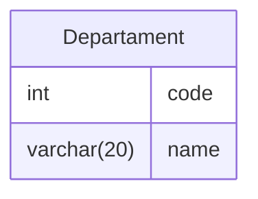

## Introduction

Our preliminary discussions have provided a glimpse into the essential tools and techniques required for effective manipulation and extraction of valuable information from databases. This guide serves as an invitation to enthusiasts and passionate individuals alike, beckoning them to explore the richness of SQL.

In the upcoming chapters, we will meticulously dissect specific SQL commands and practices, empowering you with the knowledge and skills needed to proficiently manage and query databases. Whether you are a newcomer eager to grasp the fundamentals or a seasoned practitioner looking to refine your techniques, our guide is tailored to enhance your SQL experience.

## Data Definition Language (DDL)

Data Definition Language (DDL) constitutes a specialized set of SQL instructions designed to facilitate the creation, alteration, and deletion of tables and indexes within a relational database. These commands are fundamental in defining and managing the structure of the database itself, shaping the way data is organized and accessed.



> ***Note:** Relational-model representation of the table Departament*

DDL enable database administrators and developers to define the structure, constraints, and relationships between data elements. The ability to create, alter, and delete tables and indexes empowers users to adapt the database schema to evolving requirements, ensuring a robust and well-defined foundation for data management.

As a result, DDL commands are crucial in establishing the framework that governs how data is organized, stored, and accessed within a relational database system.

# 

### Creating Tables

When creating tables in a database using SQL, the `CREATE TABLE` command is employed. The syntax typically involves specifying the **table name** (Table), the **field name** ($A_i$), and the **data type** of that field ($D_i$). 

```sql
CREATE TABLE TABLE (A1 D1, A2 D2, ... , An Dn);
```

> ***Note:** Table is the table name, Ai is the attribute of the field in table Table, and Di is the data type of the field Ai.*

This structure helps define the schema or structure of the database by outlining the properties of each field within the table.

For example, let's say we want to create a table named "Employees" with fields for employee `ID`, `name`, and `age`. The SQL statement could look like this:

```sql
CREATE TABLE Employees
(
    EmployeeID int,
    Name varchar(50),
    Age int
);
```

In this example:
- `Employees` is the table name (Table).
- `EmployeeID`, `Name`, and `Age` are the field names ($A_i$).
- `INT` and `VARCHAR(50)` are the data types ($D_i$) for the respective fields.

This `CREATE TABLE` statement establishes the blueprint for the "Employees" table, indicating the types of data that can be stored in each column. It's a fundamental step in the database design process and enables the system to enforce data integrity and structure.

A table is **initially created empty**, without any records. The `INSERT` command, which will be discussed later, is used to load data into the table.


**Create Table Using Another Table**

A copy of an existing table can also be created using `CREATE TABLE` command. 

The new table gets the same column definitions, and all columns or specific columns can be selected. 

```sql
CREATE TABLE new_table_name AS
    SELECT column1, column2, ... , columnN 
    FROM existing_table_name;
```

> ***Note:** If you create a new table using an existing table, the new table will be filled with the existing values from the old table.*

#

**Integrity Constraints**

Integrity constraints are a crucial aspect of database management systems, ensuring the accuracy, consistency, and reliability of the data stored within the system. These constraints define and enforce rules that the data must adhere to, preventing the introduction of inconsistencies or invalid information by users or external processes. 

Several types of integrity constraints exist, each serving a specific purpose in maintaining the overall quality and reliability of the database.

**Primary Key**

One essential integrity constraint is the Primary Key constraint. The primary key uniquely identifies each record (row) within a table, providing a means to distinguish one record from another. 

A primary key is typically composed of one or more fields in the table, and its values must be unique and cannot contain null values. This ensures that each record can be unequivocally identified and that there are no duplicate or missing key values.

```sql
CREATE TABLE Employees
(
    EmployeeID int NOT NULL PRIMARY KEY,
    Name varchar(50),
    Age int
);
```

> ***Note:** In Interbase, the use of the NOT NULL clause is mandatory for the field(s) of the primary key.*

Optionally, you can define the primary key after specifying all the attributes of the table. 

```sql
CREATE TABLE Employees
(
    EmployeeID int NOT NULL,
    Name varchar(50),
    Age int,
  PRIMARY KEY(registration)
);
```

When a table has a composite primary key consisting of more than one field, this approach is mandatory.

#

**Avoiding Null Values**

It is a common practice in database design to establish fields that must not contain null values, emphasizing the importance of mandatory data entry to maintain the overall integrity of the system. When a field is designated as mandatory, it implies that providing a value for that field is a requirement for each record in the database.

To achieve this, the `NOT NULL` clause is utilized in the SQL schema definition. This clause is placed after specifying the field, signaling to the database system that the corresponding attribute must always have a valid, non-null value. The purpose of this constraint is to prevent the occurrence of incomplete or missing information in critical fields.

```sql
CREATE TABLE Employees
(
    EmployeeID int NOT NULL PRIMARY KEY,
    Name varchar(50) NOT NULL,
    Age int
);
```

> ***Note:** If the user forgets to fill it in, the Database Management System (DBMS) will present an error message.*

By enforcing the `NOT NULL` constraint, database administrators can enhance data accuracy and consistency, as well as mitigate the risk of incomplete or unreliable information within the system. This approach contributes to the overall effectiveness of the database in supporting the intended business processes and applications.

#

**Avoiding Duplicate Values**

In certain situations, it may be necessary to ensure that the value stored in a field of a record is unique in relation to all other records in the table. In other words, there cannot be two records with the same value for a particular field. To implement this integrity constraint, the UNIQUE clause should be used after specifying a column.

The `UNIQUE` constraint ensures that the values in a specific column (or set of columns) must be unique across all records in the table. If an attempt is made to insert or update a record with a value that already exists in the designated column, the database management system will raise an error.

```sql
CREATE TABLE Products
(
    ProductID INT PRIMARY KEY,
    ProductName VARCHAR(50) UNIQUE,
    Price DECIMAL(10,2)
);
```

> ***Note:** In Interbase, the use of the NOT NULL clause is mandatory together with the UNIQUE clause.*

In this example, the `ProductName` column is marked as `UNIQUE`, indicating that each product must have a distinct name. If a user tries to insert a new product with a name that already exists in the "Products" table, the database system will prevent the operation and report a violation of the `UNIQUE` constraint.

By employing the `UNIQUE` constraint, data integrity is enhanced by avoiding the occurrence of duplicate values in critical fields, ensuring that each record is uniquely identifiable based on the specified criteria. 

#

**Defining Default Values**

It is possible to set a default value for a field by adding the `DEFAULT` clause to its definition. This clause allows automatic substitution of null values with a specified initial value. 


```sql
CREATE TABLE Employees
(
    EmployeeID INT PRIMARY KEY,
    FirstName VARCHAR(50) NOT NULL,
    LastName VARCHAR(50) NOT NULL,
    Department VARCHAR(30) DEFAULT 'Unknown'
);
```

The `Department` column is defined with a `DEFAULT` clause, specifying 'Unknown' as the default value. This means that if a user inserts a new record without providing a value for the `Department` field, the database system will automatically set it to 'Unknown'.

By using the `DEFAULT` clause, you can ensure that certain fields have predefined values when no explicit value is provided during data insertion. This can be particularly useful for improving data consistency and simplifying data entry processes.

#

**Ensuring Valid Values**

In database design, it's not uncommon to encounter scenarios where a field should only allow specific, predefined values. The `CHECK` clause becomes a valuable tool in such situations, enabling the definition of constraints that restrict the acceptable range of values for a particular field. This ensures that only valid and expected data is stored in the database.

The `CHECK` constraint involves specifying a condition or expression within the schema definition, and it is particularly useful when dealing with fields that should adhere to a finite set of values. This can include fields representing categorical data, such as grades, statuses, or enumerated types.


```sql
CREATE TABLE Employees
(
    StudentID INT PRIMARY KEY,
    FirstName VARCHAR(50) NOT NULL,
    LastName VARCHAR(50) NOT NULL,
    Department VARCHAR(30) CHECK (Department IN ('A', 'B', 'C', 'D', 'F')),
    Salary DECIMAL(10,2) CHECK (Salary > 1000)
);
```

> ***Note:** The CHECK constraint is not limited to enumerations; it can also involve more complex conditions based on business rules or specific criteria.*

In this example, the CHECK clause is applied to the `Department` column, ensuring that only the values $A$, $B$, $C$, $D$, or $F$ can be inserted into or updated for this field. If an attempt is made to introduce a different grade value, the database management system will reject the operation, preventing the storage of invalid or unexpected data.

This powerful feature acts as a gatekeeper for data integrity, enforcing predefined rules at the database level and contributing to the overall reliability and accuracy of the stored information.

#

**Referential Integrity**

Often, we want to ensure that the value stored in a specific field of a table is present in the primary key of another table. This attribute is known as a foreign key (**FOREIGN KEY**).

For example, the **Dept** field in the **Employee** table should contain the code of a department previously registered in the **Department** table. To ensure that this restriction is always upheld, the **REFERENCES** clause is used in defining the **Dept** field in the **Employee** table.

Thus, the **Dept** field in the **Employee** table is designated as a foreign key and will only be allowed to store values that are previously registered in the **Code** field of the **Department** table. This relationship between tables is known as referential integrity.

```sql
CREATE TABLE Department
(
    Code INT PRIMARY KEY,
    Name VARCHAR(50) NOT NULL
);
```

> ***Note:**  The Department table has the Code field as the primary key.*

Similar to the definition of the primary key, the foreign key can be specified after defining all the fields in the table.

```sql
CREATE TABLE Employee
(
    Enrollment INT PRIMARY KEY,
    Name VARCHAR(30) NOT NULL,
    ID INT,
    Gender CHAR(1),
    Dept INT,
    Address VARCHAR(50),
    City VARCHAR(20),
    Salary DECIMAL(10,2),
    FOREIGN KEY (Department) REFERENCES Department(Code)
);
```

The **Employee** table contains the **Dept** field as a foreign key, referencing the primary key **Code** of the **Department** table. This ensures that each value in the **Dept** field of the **Employee** table corresponds to a valid code in the **Department** table.

Thus, referential integrity is maintained, preventing the inclusion of invalid values in the **Dept** field of the **Employee** table and ensuring that the relationships between the tables are consistent and reliable.

#

### Removing a Table

The process of removing a table from an SQL database involves the use of the `DROP TABLE` command. This command is a powerful tool that irreversibly removes the entire table structure and all associated data, essentially eliminating all traces of the specified relation.

```sql
DROP TABLE TableName;
```

Executing this command results in the complete removal of the specified table and its contents from the database. It is essential to exercise caution when using the DROP TABLE command, as there is no way to recover the data once the table has been dropped.

It is advisable to perform a backup or ensure the removal of a table is intended before executing the `DROP TABLE` command, as unintended use can lead to data loss. This command is a powerful administrative tool and should be used with care to maintain the integrity of the database.

#

### Modifying a Table

The `ALTER TABLE` command in SQL serves as a versatile tool for making adjustments to the structure of an existing table. This command empowers database administrators and developers to modify various aspects of a table, including adding new columns, removing existing ones, and altering the properties of columns.

Here are some common use cases for the `ALTER TABLE` command:

**Adding Columns**
```sql
ALTER TABLE TableName
  ADD ColumnName DataType;
```
> ***Note:** This query allows you to add a new column to the specified table.*

**Dropping Columns**
```sql
ALTER TABLE TableName
  DROP COLUMN ColumnName;
```
> ***Note:** Use this query to remove a column from the table.*

**Modifying Column Data Types**
```sql
ALTER TABLE TableName
  ALTER COLUMN ColumnName NewDataType;
```

> ***Note:** This query allows you to change the data type of an existing column.*

**Renaming Table**
```sql
ALTER TABLE TableName
  RENAME COLUMN ColumnName to newColumnName;
```
> ***Note:** This query allows you to rename a table.*

It's crucial to note that the specific syntax may vary slightly depending on the SQL database management system being used (e.g., MySQL, PostgreSQL, SQL Server). The `ALTER TABLE` command provides flexibility in adapting and evolving the database schema to meet changing requirements without the need to recreate the entire table.

#

### Indexes

Indexes are essential components in a database designed to accelerate data access and optimize query performance. 

An index can be associated with a single column or a combination of multiple columns, facilitating quick retrieval of specific records from a table. Once an index is created, all changes made to the table are automatically reflected in the index, maintaining data consistency.

The creation and removal of indexes are handled by two primary SQL statements: `CREATE INDEX` and `DROP INDEX`.

**Creating Indexes**

The CREATE INDEX statement is used to create indexes on a table. This statement requires the definition of a name for the index to be created, followed by the table name, and finally, a list containing the names of the attributes that compose the index.

```sql
CREATE INDEX IndexName
  ON TableName (Attribute1, Attribute2, ...);
```

Example:

```sql
CREATE INDEX idx_name ON Employee (Name);
```

In this example, an index named **idx_name** is being created on the **Employee** table based on the **Name** attribute. This results in an index that speeds up the search for specific records in the table, utilizing the index associated with the **Name** column.

Indexes play a crucial role in optimizing query performance, especially in large tables, providing more efficient data retrieval. However, it's important to balance the creation of indexes, as an excessive number of indexes can impact the performance of update and insert operations.

**There are two main reasons to use indexes in a database:**

- **Preventing Duplicate Data and Enhancing Integrity:** The use of the `UNIQUE` clause when creating indexes helps prevent duplicate data, reinforcing the integrity of the database. When an index is created with the `UNIQUE` clause, it prohibits two rows in the table from having the same value in the indexed attribute or set of attributes. This promotes data consistency, ensuring that each value is unique, which is crucial for maintaining referential integrity and data quality.

  ```sql
  CREATE UNIQUE INDEX idx_name
    ON Employee (Name);
  ```
     
- **Improving Database Speed:** Creating indexes that are relevant to the most common and frequent queries in the database can significantly increase query speed. By creating indexes on columns often used in WHERE, JOIN, or ORDER BY clauses, the database can efficiently locate the desired records, reducing the time required to perform specific queries.

**Considerations on Index Usage:**
- **Caution in Creation:** While indexes can improve query speed, it's essential to exercise caution in their creation. There are no strict limits on the quantity of indexes that can be created, but excessive indexing can consume disk space and may not always optimize queries, as there is no control over how the data will be accessed.

- **Disk Space:** Indexes occupy disk space, and the decision to create an index should consider the balance between the expected benefit in query speed and the cost in terms of additional storage.

- **Impact on Updates:** It's important to consider the impact of indexes on update operations, such as inserts, updates, and deletes. Additional indexes can affect the performance of these operations.

The use of indexes can increase query speed; however, caution must be exercised in creating these indexes. There are no limits regarding the quantity of indexes that can be created. Nevertheless, it is known that they occupy disk space and do not always optimize queries because there is no control over how the data will be accessed.

#

**Removing Indexes**

To remove indexes, the `DROP INDEX` statement is employed. This statement allows for the elimination of previously created indexes on specific columns or combinations of columns in a table.

```sql
DROP INDEX IndexName;
```

This action revokes the indexing structure on the specified column or columns, and queries will no longer benefit from the accelerated data retrieval provided by that particular index.

It's crucial to exercise caution when removing indexes, as doing so may impact the performance of queries that relied on those indexes for speedy data access. Additionally, consider the potential consequences on write operations (inserts, updates, deletes) when deciding to remove indexes, as these operations might be influenced by the presence or absence of certain indexes.

## Data Manipulation Language (DML)

Data Manipulation Language (DML) constitutes a critical aspect of Structured Query Language (SQL), focusing specifically on the manipulation and management of data within a relational database. DML commands empower users to interact with the data stored in tables, providing a versatile set of operations that include inserting new data, updating existing records, selecting specific information, and deleting data when necessary.

<table align="center">
  <tr>
    <th>StudentID</th>
    <th>Name</th>
    <th>Grade</th>
    <th>Class</th>
    <th>Address</th>
  </tr>
  <tr>
    <td>112121</td>
    <td>Maria Pereira</td>
    <td>2</td>
    <td>A</td>
    <td>23 Pio XII Street</td>
  </tr>
  <tr>
    <td>524271</td>
    <td>Ryan Cullen</td>
    <td>3</td>
    <td>B</td>
    <td>45 Straight Street</td>
  </tr>
  <tr>
    <td>321233</td>
    <td>Rui Barros</td>
    <td>1</td>
    <td>B</td>
    <td>32 Edson Street</td>
  </tr>
  <tr>
    <td>453627</td>
    <td>Ivo Pitanga</td>
    <td>3</td>
    <td>A</td>
    <td>34 Round Square</td>
  </tr>
</table>

> ***Note:** Table Students*

They provide users, including database administrators and application developers, with the capability to maintain data accuracy, perform updates, retrieve specific information, and remove obsolete records. The flexible nature of DML commands ensures that databases can adapt to evolving needs, making them a cornerstone in ensuring the integrity and relevance of data within an information system.

### Inserting Records

To add new data records to a table within a relational database, the SQL `INSERT INTO` command is employed. This command enables the explicit specification of values for each field of the record being added. Suppose we want to insert a student with the following data:

<table align = "center">
  <tr>
    <td>123251</td>
    <td>John Smith</td>
    <td>3</td>
    <td>B</td>
    <td>Main Street, 45</td>
  </tr>
</table>

This `INSERT INTO` statement adds a new student record to the **Students** table, providing specific values for each corresponding column. 

```sql
INSERT INTO TABLE Students (StudentID, Name, Series, Class, Address) VALUES (123251, 'John Smith', 3, 'B', 'Main Street, 45');
```

> ***Note:** In this example, the values are specified in the order in which the fields were defined in the table.*

In cases where the user might not recall the order of the attributes, it is permissible to specify the attributes as part of the `INSERT` statement.

```sql
INSERT INTO TABLE Students (Name, StudentID, Series, Address, Class) VALUES ('John Smith', 123251, 3, 'Main Street, 45', 'B');
```

The flexibility of the `INSERT INTO` command allows for the seamless addition of diverse data into a database, providing a dynamic and adaptable mechanism for populating tables with relevant information.

#

### Removing Records

The process of eliminating records from a table is carried out using the `DELETE` statement in SQL. This statement is a fundamental component of Data Manipulation Language (DML) and provides a means to selectively remove specific rows based on specified conditions. Let's delve into a more comprehensive explanation:

```sql
DELETE FROM TableName WHERE Condition;
```

> ***Note:** If no condition is specified, all records from the table will be removed.*

For example, if we want to remove a student with a certain StudentID from a hypothetical **Students** table:

```sql
DELETE FROM Students
  WHERE StudentID = 123251;
```

> ***Note:** In this scenario, the student record with the StudentID 101 will be removed.*

It's crucial to exercise caution when using the `DELETE` statement, especially when a condition is not specified, as it can result in the removal of all records from the table. 

Additionally, it's recommended to use conditions that precisely target the records intended for removal to avoid unintended data loss.

```sql
DELETE FROM Students;
```

> ***Note:** In this scenario, all students records will be removed.*

The `DELETE` statement is a powerful tool for managing data within a relational database, allowing users to efficiently remove records that are no longer needed or that meet specific criteria.

#

### Record Modification

To modify the value of a field for a specific record or for records that meet a particular condition, the `UPDATE` statement is employed in SQL. Let's expand on this concept using the example where the student Ryan Cullen (StudentID = 524271) will be transferred to the fourth grade.

```sql
UPDATE Students
  SET Grade = 4
  WHERE StudentID = 524271;
```

In this example:
- **Field to be Updated (SET):** The "Grade" field will be updated.
- **New Value:** 4 (indicating the fourth grade).
- **Condition (WHERE):** The update will only be applied to the record where the StudentID is equal to 524271.

Suppose now that all students from the third grade B will be transferred to the fourth grade.

```sql
UPDATE Students
  SET Grade = 4
  WHERE StudentID = 524271 AND Class = 'B';
```

This `UPDATE` statement ensures that the information about José da Silva in the "Students" table reflects his transfer to the fourth grade. The flexibility of the `UPDATE` statement allows for precise modifications to specific records or a set of records based on defined conditions, providing a powerful mechanism for managing and updating data within a relational database.

#

###


